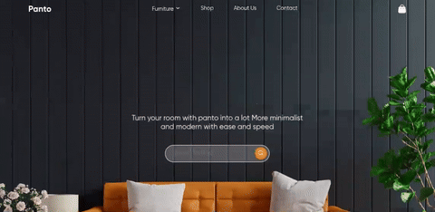

# Panto
<p align="center">
  
</p>
<p align="center">
  
</p>

## 🚀 Overview
This is a **Conversion** of figma file to pure html/css/js with custom animations

* **fork from the orignal designer:** [Panto Furniture Landing Page](https://www.figma.com/design/djWqFNRq3egdbPfNE0YVhk/Panto---Furniture-Landing-Page-Design--Community-?node-id=131-1408&t=D18TpjVBKhHQXPmu-1)
* my work: https://panto.minhaj.my

## ✨ Features
* Fast HMR with Vite.
* Fully responsive CSS layout.
* Seamless deployment on Vercel.


**Install dependencies:**
   ```bash
   bun install
#Start development server:
bun run dev
#Expose to local network:
bun run dev --host
#Build for production:
bun run  vite build
```

----


This project is mobile first desing so ,It isn't yet responsive from the product section

----


*backdrop-filter in css aren't working for multiple browswe according to desing* .

## 📜 License


Feel free to make it break it  fork or use it and help me  it in multiple sections to make responsive for bigger screens .  

Copyright © 2026 minhaj

This project is [MIT](https://opensource.org/licenses/MIT) licensed.


